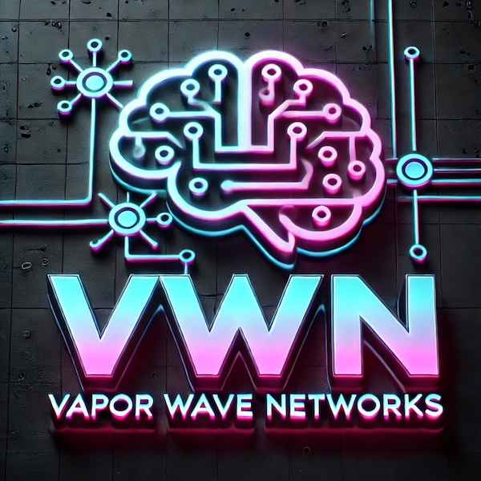

# EdgeVault™
## Web3-Ready Distributed Storage Platform

> *"Decentralized storage with enterprise-grade intelligence"*

## Product Overview

EdgeVault redefines enterprise storage for the Web3 era, combining distributed ledger technology with intelligent data routing to create a resilient, secure, and compliant storage ecosystem. This next-generation platform leverages edge computing principles to store data closer to where it's needed while ensuring regulatory compliance through automated data governance across global jurisdictions.

## Key Features

### 🌐 Web3-Ready Architecture
- Decentralized storage with blockchain verification
- Tokenized access control with smart contract integration
- Self-sovereign identity support for granular permissions
- Multi-chain compatibility with major blockchain networks

### 🧠 Smart Data Routing
- AI-driven data placement based on access patterns
- Predictive caching at the network edge
- Latency-optimized content delivery
- Geographic-aware storage for regulatory compliance

### 🔒 End-to-End Security
- Zero-knowledge encryption with client-side key management
- Quantum-resistant cryptographic algorithms
- Tamper-evident storage with blockchain verification
- Homomorphic encryption support for secure processing

### 📋 Automated Data Governance
- Policy-driven data lifecycle management
- Jurisdictional compliance automation
- AI-powered data classification and tagging
- Automated PII detection and protection

## Technical Specifications

| Feature | Specification |
|---------|---------------|
| Architecture | Distributed storage with edge caching |
| Blockchain Support | Ethereum, Polkadot, Solana, Hyperledger, Custom |
| Data Redundancy | N+3 with geographic distribution |
| Global Footprint | 37 regions, 148 edge locations |
| Throughput | Up to 20 GB/s per storage cluster |
| Latency | <10ms edge access (region dependent) |
| APIs | S3-compatible, REST, GraphQL, Web3 |
| Smart Contracts | Solidity, Ink!, CosmWasm |

## Deployment Scenarios

### Enterprise Web3 Infrastructure
Build the foundation for decentralized applications and services with enterprise-grade reliability, performance, and compliance.

### Global Content Distribution
Distribute content globally with intelligent edge caching, regional compliance, and optimized delivery based on access patterns and user location.

### Secure Multi-Party Collaboration
Enable secure collaboration across organizational boundaries with cryptographically enforced access controls and complete audit trails.

### Digital Asset Management
Securely store, manage, and distribute digital assets with tokenized access, verifiable provenance, and intelligent rights management.

## ROI Impact

- **73%** reduction in data access latency through edge caching
- **64%** decrease in cross-border compliance incidents
- **42%** lower storage costs through intelligent tiering
- **91%** faster deployment of blockchain-based applications

## Advanced Capabilities

### Data Sovereignty Engine
Automatically enforce data residency requirements through intelligent routing and storage policies that adapt to changing regulations across jurisdictions.

### Token-Based Access Economy
Implement fine-grained access control through non-fungible tokens (NFTs) that represent access rights, enabling novel business models and secure sharing economies.

### Verifiable Compute
Perform computations on sensitive data while maintaining privacy and verifying the integrity of results through zero-knowledge proofs and secure multi-party computation.

## EdgeVault Control Center

Our comprehensive management dashboard provides:

- **Global Data Visualization** - Real-time view of data distribution and access patterns
- **Compliance Mapping** - Visual representation of regulatory compliance across regions
- **Smart Contract Registry** - Management of access control and data governance contracts
- **Tokenomics Dashboard** - Monitoring of storage utilization and token-based transactions

## Compliance & Certification

- GDPR Compliant with Automated Data Sovereignty
- SOC2 Type II Certified
- ISO 27001 Certified
- EU AI Act Compliant
- Cryptocurrency Security Standard (CCSS) Level 3
- eIDAS Qualified Trust Service Provider

---

*© 2025 Vapor Wave Networks | Powering the Intelligent Network Revolution*
