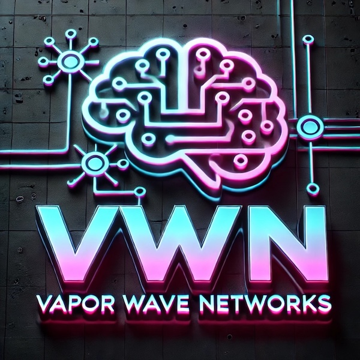

# ZeroTrust Orchestrator™
## AI-Driven Security Automation Platform

> *"Trust nothing, verify everything, automate intelligently"*

## Product Overview

ZeroTrust Orchestrator represents the next evolution in security automation, leveraging advanced AI to implement and manage comprehensive zero-trust architectures across complex hybrid environments. This intelligent platform continuously validates trust, autonomously responds to emerging threats, and ensures consistent security posture across your entire digital ecosystem.

## Key Features

### 🧠 Autonomous Security Intelligence
- AI-driven orchestration with continuous learning capabilities
- Real-time policy adaptation based on threat intelligence
- Predictive security posture assessment with risk forecasting
- Autonomous healing capabilities for compromised systems

### 🔄 Continuous Trust Verification
- Never trust, always verify framework for all network communication
- Dynamic risk scoring for users, devices, and applications
- Context-aware authentication and authorization
- Continuous device posture and compliance verification

### 🛡️ Adaptive Defense Automation
- Real-time threat detection with automatic countermeasure deployment
- Security policy automation with natural language interface
- Autonomous incident response with human oversight
- Attack surface reduction through intelligent microsegmentation

### 📊 Security Posture Visibility
- Real-time unified security dashboard across all environments
- Executive-level security metrics with business impact assessment
- Compliance monitoring with automated gap remediation
- Threat hunting assistant with AI-guided investigation

## Technical Specifications

| Feature | Specification |
|---------|---------------|
| Deployment Models | SaaS, Private Cloud, On-Premise, Hybrid |
| Integration | 250+ security tools and platforms supported |
| Policy Engine | Natural language processing with intent recognition |
| Authentication Support | SAML, OAuth, OIDC, FIDO2, X.509, Biometric |
| API Security | OpenAPI validation, JWT verification, rate limiting |
| Microsegmentation | Layer 4-7 with application identity verification |
| Automation Workflows | Visual designer and code-based definitions |
| AI Models | Custom-trained models with federated learning |

## Deployment Scenarios

### Enterprise-Wide Zero Trust
Transform legacy security architectures into comprehensive zero-trust frameworks with phased implementation and continuous improvement through AI-driven insights.

### Multi-Cloud Security Governance
Establish consistent security controls and unified visibility across multiple cloud providers, SaaS applications, and on-premise infrastructure.

### DevSecOps Acceleration
Integrate security automation throughout the development lifecycle with CI/CD pipeline integration and autonomous security testing and verification.

### Compliance Automation
Automate compliance with regulatory frameworks including GDPR, HIPAA, PCI-DSS, and SOC2 through continuous control verification and evidence collection.

## ROI Impact

- **76%** reduction in security incident response time
- **82%** decrease in manual security operations tasks
- **64%** improvement in security policy consistency
- **59%** reduction in successful breach attempts

## ZeroTrust Command Center

Our intuitive command center provides comprehensive visibility and control:

- **Trust Graph™** - Visual representation of all entities and trust relationships
- **Autonomous Response Tracker** - Real-time visibility into automated security actions
- **Compliance Posture** - Continuous assessment against regulatory frameworks
- **Threat Intelligence Feed** - Contextualized global and industry-specific threats

## Advanced Capabilities

### Security Digital Twin
Create a digital twin of your environment to simulate security scenarios, test policies, and predict the impact of changes before implementation.

### Natural Language Security Policy
Define security policies using natural language, allowing business stakeholders to collaborate on security requirements without specialized knowledge.

### Autonomous Remediation
Enable the platform to automatically remediate common security issues, from misconfigured cloud resources to vulnerable software components.

## Compliance & Certification

- EU AI Act Compliant
- SOC2 Type II Certified
- ISO 27001 Certified
- FedRAMP Moderate
- GDPR Compliant
- HIPAA Compliant

---

*© 2025 Vapor Wave Networks | Powering the Intelligent Network Revolution*
